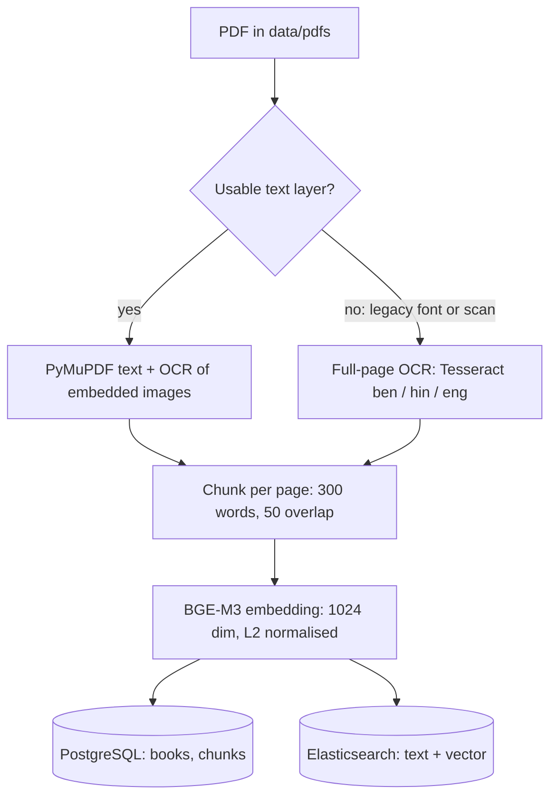
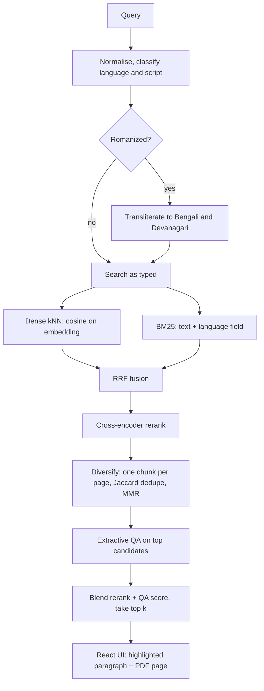
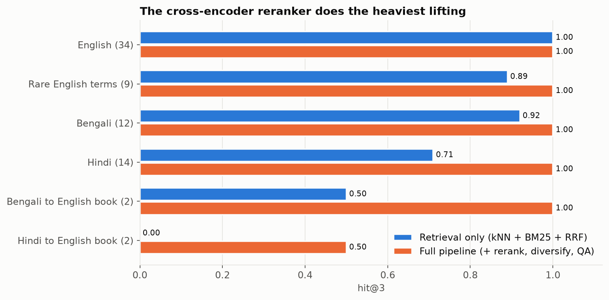
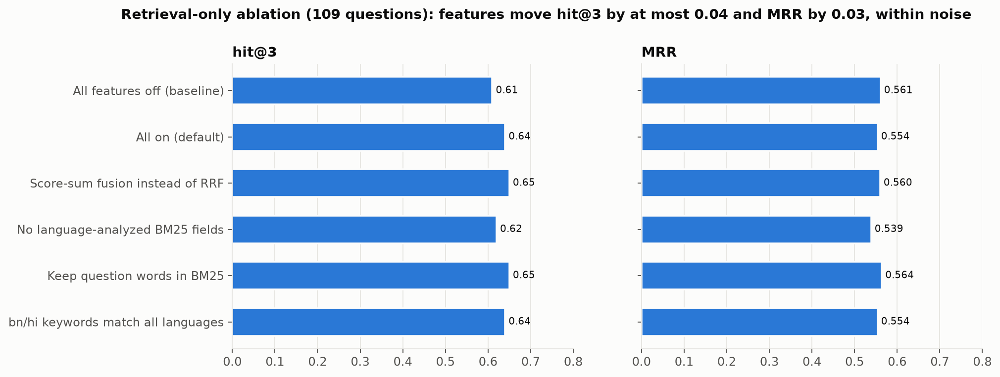
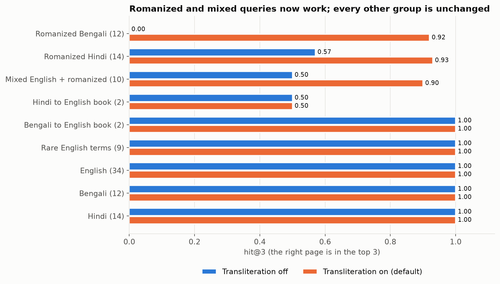
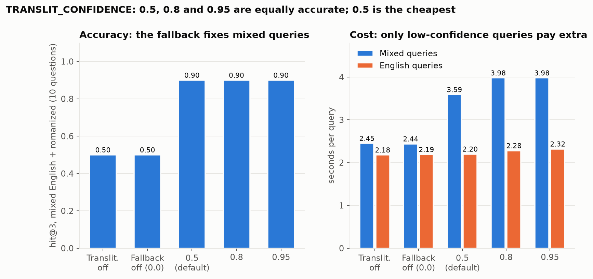
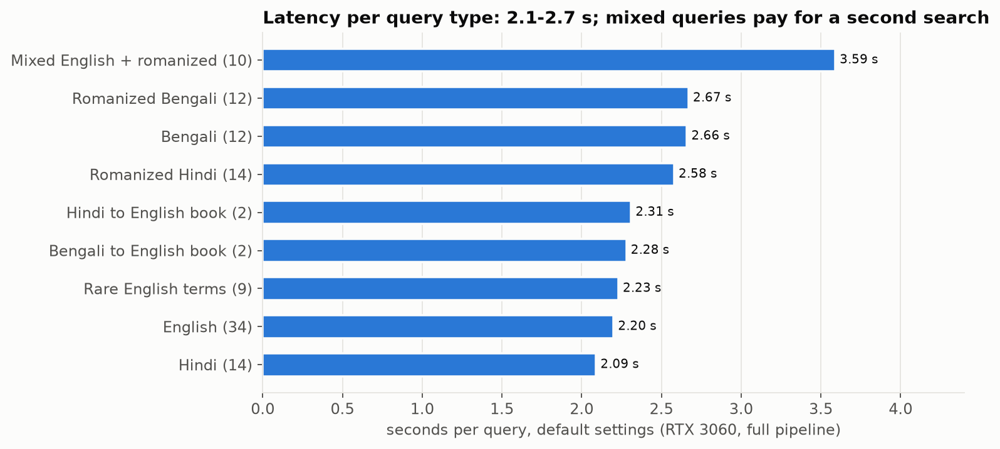
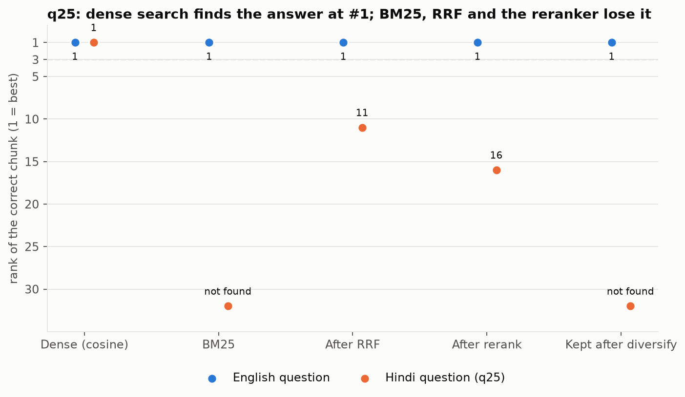
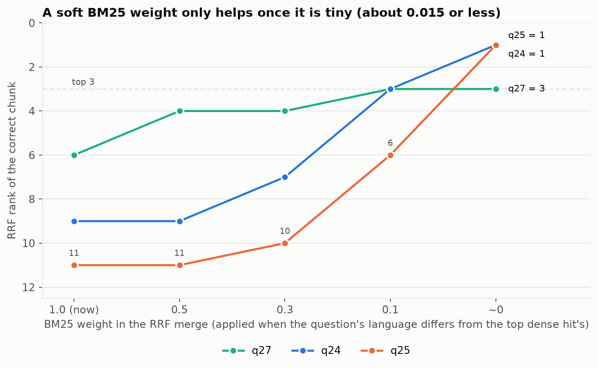
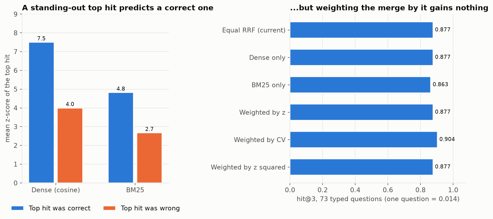

# OSISS — Open-Source Institutional Scholar Search

OSISS is an **offline, multilingual (Bengali / Hindi / English) semantic search engine over institutional PDFs**
(textbooks, lecture notes, question banks). You ask a question in any of the three languages — native script,
romanized ("goti kake bole?"), or a mix — and it returns **extractive quotes taken verbatim from the books**,
with the book, the page, a highlighted paragraph and a link into the PDF. It never generates text, so it cannot
invent an answer; everything on screen exists in a source book.

This document describes the whole project: what it is made of, how a query flows through it, the maths behind each
step, every improvement that was tried (with measured results and graphs, including the ideas that did *not* work),
and what is still weak.

## Contents

1. [At a glance](#1-at-a-glance)
2. [Architecture](#2-architecture)
3. [Tech stack, libraries and models](#3-tech-stack-libraries-and-models)
4. [Ingestion pipeline](#4-ingestion-pipeline)
5. [How a search works, step by step](#5-how-a-search-works-step-by-step)
6. [Mathematical reference](#6-mathematical-reference)
7. [Evaluation method](#7-evaluation-method)
8. [Improvements and experiments, with results](#8-improvements-and-experiments-with-results)
9. [Current accuracy and known limits](#9-current-accuracy-and-known-limits)
10. [Setup and usage](#10-setup-and-usage)
11. [Configuration reference](#11-configuration-reference)
12. [Project structure](#12-project-structure)
13. [Testing and reproducing the results](#13-testing-and-reproducing-the-results)
14. [Troubleshooting](#14-troubleshooting)
15. [Roadmap](#15-roadmap)
16. [Licenses](#16-licenses)

---

## 1. At a glance

| | |
|---|---|
| **What it returns** | Verbatim sentences from the books (extractive QA), the matched paragraph with the answer highlighted, book title, author, department, page number, a PDF link. |
| **Languages** | Bengali, Hindi, English. Queries may be native script, romanized Bengali/Hindi, or mixed. |
| **Corpus today** | 17 books, 5,485 pages, 8,606 chunks: 8 English books and 9 Bengali/Hindi textbooks. |
| **Runs offline** | All models load from `models/` with `local_files_only=True`; no external API calls at query time. |
| **Hardware used for the numbers below** | One RTX 3060 (12 GB). About 2.1–2.7 s per query, 3.6 s for mixed-language queries. |
| **Accuracy** | Right page in the top 3 for **96 %** of 109 evaluation questions (top-1: 81 %). See [section 9](#9-current-accuracy-and-known-limits) for why that number is optimistic. |

---

## 2. Architecture

Two pipelines share one PostgreSQL database (books, chunks) and one Elasticsearch index (text + embeddings).

**Ingestion** (PDF to searchable chunks):



**Search** (question to highlighted answer):



* **Ingestion** (`src/ingest.py`, helpers in `src/utils.py`) runs once or as a watcher over `data/pdfs/`.
* **Search** (`src/search.py`, model-free helpers in `src/ranking.py` and `src/translit.py`) is called by the
  FastAPI server (`src/api_server.py`), which also serves the PDFs under `/data`.
* **Frontend** (`frontend/`) is a React app; the page viewer is an `<iframe>` on `pdf_link#page=N`.

---

## 3. Tech stack, libraries and models

### Services

| Component | Version | Role |
|---|---|---|
| Elasticsearch | 8.10.4 (Docker) | Dense vector index (`dense_vector`, cosine) and BM25 with Bengali/Hindi/English analyzers. Security disabled, single node. |
| PostgreSQL | 15 (Docker, host port 5433) | Book and chunk metadata; source of truth for re-indexing. |
| Tesseract OCR | 5.3.4 with `eng`, `ben`, `hin` packs | OCR for embedded images and for books with an unusable text layer. |
| Docker Compose | — | Starts Postgres and Elasticsearch. |

### Models (all run locally)

| Model | Size on disk | Purpose | License |
|---|---|---|---|
| `BAAI/bge-m3` | 4.3 GB | Multilingual dense embeddings (1024-d); embeds chunks and queries | MIT |
| `BAAI/bge-reranker-v2-m3` | 2.2 GB | Cross-encoder reranker, scores (query, chunk) pairs | Apache-2.0 |
| `deepset/xlm-roberta-large-squad2` | 4.2 GB | Extractive question answering (finds the answer span) | CC-BY-4.0 |
| `Singla0009/all-indic-transliteration` (IndicXlit, CTranslate2 build) | 45 MB | Romanized → Bengali / Devanagari transliteration | MIT |

### Python libraries (installed versions)

| Library | Version | Used for |
|---|---|---|
| `elasticsearch` | 8.10.1 | Index, kNN and BM25 queries, bulk indexing |
| `psycopg2-binary` | 2.9.11 | PostgreSQL access |
| `PyMuPDF` | 1.27.2 | PDF text extraction and page rendering for OCR |
| `pytesseract`, `Pillow` | 0.3.13, 12.2.0 | OCR wrapper and image handling |
| `sentence-transformers` | 5.4.1 | BGE-M3 embedder and the `CrossEncoder` reranker |
| `transformers`, `sentencepiece` | 4.57.6, 0.2.1 | QA pipeline and tokenizers (a windowed fallback QA runner is included) |
| `torch` | 2.11.0 | Model inference (CUDA or CPU) |
| `ctranslate2` | 4.8.2 | Fast transliteration inference on CPU, no PyTorch needed |
| `numpy` | 2.4.4 | MMR, score fusion maths |
| `fastapi`, `uvicorn`, `pydantic` | 0.136.0, 0.44.0, 2.13.1 | HTTP API |
| `huggingface_hub` | 0.36.2 | Model download |
| `tiktoken`, `protobuf`, `tqdm` | 0.12.0, 7.34.1, 4.67.3 | Tokenizer and utility dependencies |
| `pytest` | 9.1.1 | Unit tests |
| `matplotlib` *(docs only)* | — | Regenerates the graphs in this README; not needed to run the engine |

### Frontend

React 19, TypeScript 6, Vite 8, Tailwind CSS 3, `lucide-react` icons. Vite 8 needs Node 20.19+ or 22.12+.

---

## 4. Ingestion pipeline

```
PDF → text (or OCR) → per-page word chunks → embeddings → PostgreSQL rows + Elasticsearch documents
```

1. **Discovery and change detection.** `data/pdfs/*.pdf` is scanned (once with `--once`, or polled every
   `POLLING_INTERVAL_SECONDS`). Each file is keyed by path and a SHA-256 content hash. A changed file is deleted
   (Postgres cascade + Elasticsearch `delete_by_query`) and re-ingested. `--only NAME...` restricts a run to files whose name
   contains one of the substrings.
2. **Text extraction.** PyMuPDF reads the text layer; images embedded in a page are OCRed with Tesseract.
3. **Unusable text layers → full-page OCR.** Many Bengali and Hindi textbooks store text in *legacy fonts*
   (Kruti Dev, Bijoy) or as scans, so PyMuPDF returns garbage (`izdk'k ijkorZu` instead of `प्रकाश परावर्तन`) or nothing.
   `utils.choose_ocr_language` samples about 12 pages, classifies each page's text layer, and if the book is mostly bad it renders
   every page at 300 DPI and OCRs it with `ben+eng` or `hin+eng` (chosen by probing the script). Books with a good text layer keep the
   old path. Details and thresholds are in [section 6.9](#69-text-layer-classification-ocr-fallback).
4. **Chunking.** Words are grouped into 300-word chunks with a 50-word overlap, **per page**, so `page_number` stays exact.
   A trailing fragment shorter than 40 words is merged into the previous chunk.
5. **Flags and language.** Each chunk gets `language_code` (`bn`/`hi`/`en`, by Unicode script) and an `is_exercise` flag
   (review questions, MCQ lists, `[LO x.y]` tags); exercise chunks are excluded from search.
6. **Embedding and storage.** BGE-M3 embeds each chunk (L2-normalised, 1024-d). Rows go to Postgres (`books`, `chunks`) and documents to
   Elasticsearch with `_id = book-{id}-chunk-{idx}`.
7. **Metadata** (title / author / year / department) is currently guessed from the filename and is poor for names with hyphens
   or underscores. Manual metadata entry is the first item on the [roadmap](#15-roadmap).

### Corpus

| Book | Language | Pages | Chunks | Extraction path |
|---|---|---|---|---|
| Balagurusamy, Programming in ANSI C | en | 854 | 1,031 | text layer |
| Reema Thareja, Data Structures | en | 557 | 1,123 | text layer |
| Data Structures (book 3) | en | 554 | 657 | scan: image OCR (English) |
| English Book | en | 482 | 946 | text layer |
| Quantum mechanics question bank (`qb.pdf`) | en | 310 | 753 | text layer |
| Free energy, Stereochemistry, Intermolecular force (notes) | en | 22 / 11 / 10 | 29 / 13 / 18 | text layer |
| General Science, Class IX | bn | 233 | 349 | **full-page OCR** (legacy font) |
| HSC Social Science, 1st paper | bn | 480 | 727 | **full-page OCR** (Bijoy) |
| West Bengal Class 7 Science | bn | 173 | 179 | **full-page OCR** (scan) |
| Biggyaner Itihas (History of Science) | bn | 394 | 604 | **full-page OCR** (scan) |
| Science Class 6 (Hindi) | hi | 136 | 211 | **full-page OCR** (Kruti Dev) |
| Science Class 7 (Hindi) | hi | 260 | 364 | **full-page OCR** (Kruti Dev) |
| NCERT Science Class X (Hindi), two editions | hi | 324 / 325 | 524 / 508 | **full-page OCR** (Kruti Dev / symbol font) |
| Vigyan Class 10 (Hindi, reduced) | hi | 360 | 570 | **full-page OCR** (Kruti Dev) |

---

## 5. How a search works, step by step

Every step names the setting that controls it (see [section 11](#11-configuration-reference)).

1. **Normalise the query.** Unicode NFC, invisible characters removed (soft hyphen, zero-width space, BOM; the joiners that Bengali and
   Hindi conjuncts need are kept), whitespace collapsed.
2. **Classify the query** (`translit.query_mode`):
   * *native script* or all words known English → **english** path;
   * contains Indic marker words (`kake`, `bole`, `kise`, `kehte`, `hain`, `kya`, …) → **romanized**;
   * Latin script, no marker words, but some word is unknown to the English vocabulary → **ambiguous** (a rare English term, a lone
     romanized word, or a mix such as "what is gati").
3. **Romanized queries** are transliterated word by word to Bengali and to Devanagari (IndicXlit); Assamese letters the model
   sometimes emits (`ৰ`) are mapped back to Bengali (`র`). The query as typed and both rewrites are all searched and fused. The embedder,
   reranker and QA use the single best spelling per word; BM25 gets the top `TRANSLIT_TOPK` (3) spellings. For **ambiguous** queries the
   typed query is searched first, and the rewrites are only added if the best rerank score is below `TRANSLIT_CONFIDENCE` (0.5); each
   chunk then keeps the higher of its two rerank scores.
4. **Two retrievals in Elasticsearch**, each returning `RETRIEVAL_CANDIDATES` (30) chunks:
   * **Dense kNN** on the BGE-M3 embedding, cosine similarity (the index is mapped `"similarity": "cosine"`; vectors are unit length, so
     cosine equals the dot product).
   * **BM25** over `text` plus the query language's analyzed subfield (`text.bn` / `text.hi` / `text.en`: stemming, stopwords, Indic
     normalisation). Question words ("what", "কী", "क्या", "परिभाषा"…) are stripped from the BM25 query, both spellings of nukta letters are
     included, and Bengali/Hindi queries only match chunks of the same language (`KEYWORD_SAME_LANGUAGE`).
5. **Fuse with Reciprocal Rank Fusion** (`HYBRID_MODE=rrf`): chunks are ranked by their ranks in the two lists, not by raw scores.
6. **Rerank** the fused candidates with the cross-encoder `bge-reranker-v2-m3` (`RERANK_ENABLED`). This is the most important quality step.
7. **Diversify:** keep the best chunk per (book, page), drop near-duplicates (Jaccard ≥ 0.8, for example another edition of the same
   text), then choose `top_k + QA_EXTRA_CANDIDATES` chunks with Maximal Marginal Relevance (`MMR_LAMBDA`).
8. **Extractive QA** on those chunks: `xlm-roberta-large-squad2` finds the most probable answer span. Long chunks are read in
   384-token windows with stride 128 so the answer is never cut off.
9. **Quote and paragraph.** The sentence containing the answer span becomes the quote; neighbouring sentences (up to about 140
   words) form the matched paragraph.
10. **Final score and order:** `(1 − w)·rerank + w·QA` with `QA_RANK_WEIGHT` w = 0.3; the best `top_k` (default 3) are returned.
11. **Display** (frontend): the paragraph is cleaned for reading (bullets become list items, stray spaces and control characters are
    removed), the quoted sentence is highlighted lightly and the exact QA answer phrase strongly. Answers with a QA score below 0.02
    are not highlighted, because they are near-random spans.

### API

| Endpoint | |
|---|---|
| `GET /health` | liveness check |
| `POST /api/search` `{query, top_k}` | returns `{exact_quote, book_title, author, department, page_number, pdf_link, paragraph_text, answer_text}` per result |
| `GET /data/pdfs/<file>.pdf` | static PDFs (opened by the page viewer at `#page=N`) |

---

## 6. Mathematical reference

All formulas below are the ones the code uses (file names are given where the constants live).

### 6.1 Embedding normalisation and cosine similarity

Every chunk and query vector is scaled to unit length, $\hat v = v / \lVert v \rVert_2$ (`normalize_embeddings=True`). Cosine similarity is then a dot product:

$$\cos(q, d) = \frac{q \cdot d}{\lVert q \rVert\,\lVert d \rVert} = \hat q \cdot \hat d \in [-1, 1].$$

Elasticsearch ranks kNN hits by $\text{score}_{\text{kNN}} = \dfrac{1 + \cos(q,d)}{2}$, which is why raw dense scores look like 0.7–0.9.
Chunks are indexed with `dims = 1024`, `similarity = cosine`.

### 6.2 BM25 (keyword search)

Elasticsearch's default BM25 with $k_1 = 1.2$, $b = 0.75$:

$$\text{BM25}(D,Q) = \sum_{t \in Q} \text{IDF}(t)\cdot \frac{f(t,D)\,(k_1 + 1)}{f(t,D) + k_1\left(1 - b + b\,\frac{|D|}{\text{avgdl}}\right)},
\qquad \text{IDF}(t) = \ln\!\left(1 + \frac{N - n_t + 0.5}{n_t + 0.5}\right)$$

where $f(t,D)$ is the term frequency, $|D|$ the document length, $N$ the number of chunks and $n_t$ the number containing $t$.
The query is a `multi_match` of type `best_fields` over `text` and `text.<lang>` with tie-breaker $\tau = 0.3$:

$$\text{score}(D) = \max_f s_f(D) + \tau \sum_{f \neq f^*} s_f(D).$$

### 6.3 Reciprocal Rank Fusion

For ranked lists $i = 1..m$ with weights $w_i$ (dense $w=1$; BM25 $w=1$ by default, setting `RRF_KEYWORD_WEIGHT`) and constant $k = 60$:

$$\text{RRF}(d) = \sum_{i} \frac{w_i}{k + \text{rank}_i(d)}.$$

A chunk missing from a list contributes nothing for that list. RRF uses only ranks, so the incomparable score scales of cosine and BM25 do not matter.
For romanized queries the lists are the query as typed (weight `TRANSLIT_ORIGINAL_WEIGHT` $= 0.5$) and each script rewrite (weight $1$).

### 6.4 Cross-encoder reranking

The reranker reads the query and the chunk together and outputs a logit $z$, turned into a probability-like score

$$r(q,d) = \sigma(z) = \frac{1}{1 + e^{-z}} \in (0,1).$$

### 6.5 Diversification

*Near-duplicate removal* uses the Jaccard similarity of word sets, dropping a candidate when $J \ge 0.8$ against an already kept one:

$$J(A,B) = \frac{|A \cap B|}{|A \cup B|}.$$

*Maximal Marginal Relevance* picks, from the remaining candidates $R \setminus S$, the one maximising

$$\text{MMR}(d) = \lambda\,\widetilde{\text{rel}}(d) - (1-\lambda)\max_{s \in S}\cos(d, s), \qquad \widetilde{\text{rel}}(d) = \frac{\text{rel}(d)}{\max_{d'} \text{rel}(d')},$$

with $\lambda = 0.85$ (setting `MMR_LAMBDA`), relevance $= r(q,d)$ (negative scores are shifted to start at 0), and $\cos$ computed on the stored chunk embeddings. $\lambda = 1$ turns diversification off.

### 6.6 Extractive QA span

For a context of $n$ tokens the model gives start logits and end logits. With softmax probabilities $p^{s}_i$ and $p^{e}_j$ the answer span is

$$(\hat i, \hat j) = \arg\max_{0 \le j - i < 30}\; p^{s}_i\, p^{e}_j, \qquad \text{qa} = p^{s}_{\hat i}\, p^{e}_{\hat j}.$$

Long chunks are read in windows of 384 tokens with stride 128 and the best span over all windows is kept.

### 6.7 Final ranking score

$$\text{final}(d) = (1 - w)\, r(q,d) + w\,\text{qa}(d), \qquad w = 0.3 .$$

The weight $w$ is the setting `QA_RANK_WEIGHT`.

### 6.8 Chunking

With size $c = 300$ words and overlap $o = 50$ the chunk starts are $0, \; c - o, \; 2(c-o), \dots$ (a step of 250 words). If fewer than 40 words would remain after a
chunk, that chunk is extended to the end of the page instead of leaving a tiny fragment.

### 6.9 Text-layer classification (OCR fallback)

For a page with at least 80 non-space characters let $I$ be the share of Indic characters (U+0900–U+0DFF) and $O$ the share of non-ASCII characters outside
Indic and general punctuation. With $\text{sw}$ the share of English stopwords among the Latin tokens (needs at least 30 tokens):

$$\text{page is } \begin{cases} \text{good} & I \ge 0.3 \\ \text{bad} & O > 0.12 \\ \text{bad} & \text{sw} < 0.06 \\ \text{good} & \text{otherwise} \end{cases} \qquad (\text{fewer than 80 characters: "empty"}).$$

Legacy-font Hindi and Bengali are made of ordinary Latin letters, which is why the stopword share (real English prose is full of *the*, *of*, *and*; `izdk'k ijkorZu` is not) catches them.
The 12 sample pages are spaced evenly between 5 % and 95 % of the book. If good pages $\ge$ bad pages and at least one is good, the normal path is used. Otherwise 4 sample pages are OCRed
with `ben+hin+eng`, and with $b, h, l$ the Bengali, Devanagari and Latin letter counts:

$$\text{Indic book} \iff b + h > 0.3\,(b + h + l) \;\Rightarrow\; \text{OCR language} = \begin{cases} \text{ben+eng} & b \ge h \\ \text{hin+eng} & \text{otherwise.} \end{cases}$$

### 6.10 Romanized-query confidence fallback

Let $r_1$ be the best rerank score of an ambiguous query searched as typed. With $\theta = 0.5$ (setting `TRANSLIT_CONFIDENCE`), the script rewrites are searched only if $r_1 < \theta$. After reranking the new chunks against their rewrite, every chunk keeps its best score:

$$r(d) = \max\bigl(r_{\text{typed}}(d),\; r_{\text{rewrite}}(d)\bigr),$$

so a good English answer (typical $r \ge 0.4$) is never displaced by a junk rewrite, and a wrong $\theta$ only costs latency.

### 6.11 Evaluation metrics

With $N$ questions and $\text{rank}_i$ the position of the first correct (file, page) in question $i$'s results (the question has a set of accepted pages):

$$\text{hit@}k = \frac{1}{N}\sum_i \mathbb{1}[\text{rank}_i \le k], \qquad \text{MRR} = \frac{1}{N}\sum_i \frac{1}{\text{rank}_i} \;(0 \text{ if not found}),$$

$$\text{nDCG@}k = \frac{\text{DCG@}k}{\text{IDCG@}k}, \quad \text{DCG@}k = \sum_{p=1}^{k}\frac{\text{rel}_p}{\log_2(p+1)}, \quad \text{rel}_p \in \{0,1\}\ \text{(each accepted page counts once)}.$$

*Answer-keyword rate* is the share of questions whose top result's quote or paragraph contains the labelled keyword.

### 6.12 Score-spread statistics used in the experiments

For a ranked score list $s_1 \ge s_2 \ge \dots \ge s_k$ ($k = 30$):

$$z_1 = \frac{s_1 - \bar s_{2..k}}{\sigma_{2..k}}, \qquad \text{CV} = \frac{\sigma}{\mu}.$$

$z_1$ measures how far the top hit stands out from the rest; CV is the spread relative to the mean. They were tested as channel weights ([section 8.7](#87-experiment-variance-and-score-spread)).

### 6.13 Why a "soft" BM25 weight must be tiny under RRF

If the correct chunk is first in the dense list and the runner-up is second, their RRF gap from the dense list alone is

$$\Delta = \frac{1}{k+1} - \frac{1}{k+2} = \frac{1}{61 \cdot 62} \approx 2.6 \times 10^{-4}.$$

A runner-up that is also in the BM25 list at rank $r$ gains $w_{\text{BM25}}/(k + r)$. To keep the dense leader on top for $r = 1$ we need $w_{\text{BM25}} < \Delta\,(k+1) = \tfrac{1}{62} \approx 0.016$.
Any "moderate" weight (0.1–0.5) therefore still lets chunks that appear in both lists overtake a dense-only leader ([section 8.6](#86-experiment-soft-bm25-weight-for-cross-language-questions)).

---

## 7. Evaluation method

`tests/eval_search.py` runs **109 hand-labelled questions** (`tests/eval/questions.json`) against the live ingested corpus. Each question lists the accepted
`(file, pages)` and an answer keyword; `--validate` checks every label against the ingested text. Several books can legitimately answer the same question
(for example the three NCERT-based Hindi books), so all of them are accepted.

| Group | Questions | What it tests |
|---|---|---|
| `en` | 34 | English questions over the English books |
| `rare-en` | 9 | English questions with unusual words |
| `bn` | 12 | Bengali questions over the Bengali books |
| `hi` | 14 | Hindi questions over the Hindi books |
| `bn->en`, `hi->en` | 2 + 2 | Bengali/Hindi questions whose answer is in an *English* book (cross-language) |
| `roman-bn`, `roman-hi` | 12 + 14 | The same Bengali/Hindi questions typed in Latin letters |
| `mixed` | 10 | English sentence with a romanized word ("What is gati in Bengali science book?") |

Reports: hit@1/3/5, MRR, nDCG@3, the answer-keyword rate, hit@3 and seconds per query for every group, and the misses.

**Be careful how you read the numbers:**
* The Bengali, Hindi, romanized and mixed questions were written from sentences in the *same OCR text the engine searches*, mostly definitions in the books' own wording. They are easier than
  real user questions; read them as a ceiling.
* The cross-language groups have two questions each; one question is 50 points.
* With 109 questions, a difference of one or two questions (0.01–0.02) is noise.
* Retrieval-only runs (`--mode retrieval`) skip the reranker and the transliteration step.

---

## 8. Improvements and experiments, with results

### 8.1 Overview

| # | Change | Result |
|---|---|---|
| 1 | Hybrid retrieval, language analyzers, MMR, deeper QA (earlier work) | Retrieval-level ablation within noise; the reranker carries most of the accuracy ([8.2](#82-where-the-accuracy-comes-from)) |
| 2 | OCR fallback for unusable text layers | 9 Bengali/Hindi books became searchable ([8.3](#83-ocr-fallback-for-legacy-font-and-scanned-books)) |
| 3 | Romanized-query transliteration | Romanized Bengali 0.00 → 0.92, romanized Hindi 0.57 → 0.93 hit@3 ([8.4](#84-romanized-queries)) |
| 4 | Confidence fallback for ambiguous and mixed queries | Mixed 0.50 → 0.90, English unchanged ([8.5](#85-ambiguous-and-mixed-queries-confidence-fallback)) |
| 5 | Soft BM25 weight for cross-language questions | Helps only when the weight is below about 0.016 — **not adopted** ([8.6](#86-experiment-soft-bm25-weight-for-cross-language-questions)) |
| 6 | Score-spread (variance) weighting | No gain — **not adopted** ([8.7](#87-experiment-variance-and-score-spread)) |
| 7 | Frontend: highlighted, cleaned paragraph | Shipped ([8.8](#88-frontend-answer-highlighting)) |

### 8.2 Where the accuracy comes from

Retrieval alone (kNN + BM25 + RRF, no reranker) finds the right page in the top 3 for 64 % of questions; the full pipeline reaches 96 %. On every group that does not need transliteration the
cross-encoder reranker lifts hit@3 — for example Hindi from 0.71 to 1.00 and Bengali to an English book from 0.50 to 1.00.



Switching individual retrieval features on and off (`--compare --mode retrieval`, 109 questions, run on CPU) moves hit@3 by at most 0.04 and MRR by 0.03, which is within noise:



| Variant (retrieval only) | hit@1 | hit@3 | MRR |
|---|---|---|---|
| All features off (baseline) | 0.48 | 0.61 | 0.561 |
| All on (default) | 0.45 | 0.64 | 0.554 |
| Score-sum fusion instead of RRF | 0.46 | 0.65 | 0.560 |
| No language-analyzed BM25 fields | 0.43 | 0.62 | 0.539 |
| Keep question words in BM25 | 0.47 | 0.65 | 0.564 |
| bn/hi keywords match all languages | 0.45 | 0.64 | 0.554 |

*Honest reading:* at this level the hybrid features are not measurably better than the baseline. The language fields help a little (MRR 0.539 without them), RRF versus score-sum is a tie,
and dedupe/MMR and the extra QA candidates act after reranking, so they only show in `--mode full`, which was not re-run for each variant (about an hour per configuration).

### 8.3 OCR fallback for legacy-font and scanned books

Nine new Bengali/Hindi textbooks had no usable text layer. Ingesting them naively would have put garbage in the index:

| Book kind | What PyMuPDF returned | Example |
|---|---|---|
| Legacy-font Hindi (Kruti Dev) | Latin letters | `izdk'k ijkorZu ,oa viorZu` |
| Legacy-font Bengali (Bijoy) | Latin letters | `KvwRb weeván àeevwnK` |
| Symbol-font Hindi | dingbats | `✁✂✄☎✆✝` |
| Scans | nothing | (empty) |

The detector ([6.9](#69-text-layer-classification-ocr-fallback)) was checked on all 17 books: the 8 existing books are left on the old path (no OCR, no change) and all 9 new books are sent to the correct OCR language.
OCR text was spot-checked on a mid-book page of each: for example `অবস্থানের পরিবর্তনই গতি` and `इसे जूल का तापन नियम कहते हैं` come out as proper Unicode. OCR cost about 1.3 s per page on one thread; with 20 worker threads about 4 pages per second.
After ingestion the new books' chunks were tagged `bn`/`hi` correctly (almost no stray `en` chunks).

### 8.4 Romanized queries

Users type "Goti kake bole?" instead of "গতি কাকে বলে?". Before the change only 3 of 8 test queries found the right page: BM25 saw Latin letters and searched them as English, and the embedder only linked a word to its Bengali form by luck.

**Fix:** transliterate to Bengali and Devanagari with IndicXlit, search the query as typed and both rewrites together, and use all candidate spellings in BM25. A first test of the model on 20 words per language:

| | Right word first | Right word in top 3 | Time for 20 words |
|---|---|---|---|
| Bengali | 8 / 20 | 14 / 20 | 57 ms |
| Hindi | 13 / 20 | 18 / 20 | 40 ms |

Single-word accuracy is modest, which is why the design uses several spellings in BM25 and a script rewrite in embeddings, and fuses everything with the query as typed. On the 26 romanized evaluation questions:

| Group | Transliteration off | on |
|---|---|---|
| Romanized Bengali (12) | 0.00 | **0.92** |
| Romanized Hindi (14) | 0.57 | **0.93** |



### 8.5 Ambiguous and mixed queries (confidence fallback)

A word the English vocabulary does not know could be a rare English term ("Zwitterion") or a lone romanized word ("vashpan"). Transliterating all of them added noise to English queries, so ambiguous queries are searched **as typed first**, and only
get the rewrites if the best rerank score is low. The score separates the cases well but not perfectly, so the design never depends on a sharp cut-off (see [6.10](#610-romanized-query-confidence-fallback)):

| Top rerank score of the query as typed | min | median | max |
|---|---|---|---|
| 34 real English questions | 0.41 | 0.99 | 1.00 |
| 26 romanized questions (searched as typed) | 0.00 | 0.01 | 0.83 (22 of 26 below 0.4) |
| Rare English terms present in the books | high, e.g. "Dijkstra algorithm" 0.999, "Chirality" 0.987 | | |
| Terms *absent* from the books | low, e.g. "Zwitterion" 0.004 | | |

Sweeping the threshold on all 109 questions (full pipeline):



| Setting | hit@1 | hit@3 | MRR | Mixed hit@3 | Mixed s/query | English s/query |
|---|---|---|---|---|---|---|
| Transliteration off | 0.62 | 0.78 | 0.697 | 0.50 | 2.45 | 2.18 |
| Fallback off (θ = 0) | 0.76 | 0.93 | 0.839 | 0.50 | 2.44 | 2.19 |
| **θ = 0.5 (default)** | 0.81 | 0.96 | 0.881 | 0.90 | 3.59 | 2.20 |
| θ = 0.8 | 0.81 | 0.96 | 0.881 | 0.90 | 3.98 | 2.28 |
| θ = 0.95 | 0.81 | 0.96 | 0.881 | 0.90 | 3.98 | 2.32 |

All three thresholds are equally accurate; 0.5 does the least extra work. Only low-confidence queries pay for the second search:



### 8.6 Experiment: soft BM25 weight for cross-language questions

**Problem (q25).** The Hindi question "विशिष्ट घूर्णन की परिभाषा क्या है?" ("what is the definition of specific rotation?") should find an *English* chemistry page. Dense search does find it — cosine 0.50 for the Hindi
question against 0.64 for the English one — but BM25 only matches Hindi books, which crowd the merge, and the reranker scores Hindi-versus-English at 0.004:



**Idea.** When the question's language differs from the top dense hit's language, give BM25 a lower weight (not zero) so both kinds of chunk still appear but the English chunk leads.
Rank of the correct chunk after the RRF merge:



| BM25 weight | 1.0 (now) | 0.5 | 0.3 | 0.1 | ≈ 0 |
|---|---|---|---|---|---|
| q24 | 9 | 9 | 7 | 3 | 1 |
| q25 | 11 | 11 | 10 | 6 | 1 |
| q26 | 1 | 1 | 1 | 1 | 1 |
| q27 | 6 | 4 | 4 | 3 | 3 |

**Result.** It works in the right direction, but only when the weight is tiny; [6.13](#613-why-a-soft-bm25-weight-must-be-tiny-under-rrf) shows why the bound is about 0.016. The rule would also fire on 2 false alarms out of 6 triggers
(q53, q102). **Not adopted yet.** It needs more cross-language eval questions first; with 4 it cannot be validated.

### 8.7 Experiment: variance and score spread

**Idea.** Weight each retrieval channel by how decisive its scores are (like IDF rewards distinctive terms). The statistic is the z-score of the top hit ([6.12](#612-score-spread-statistics-used-in-the-experiments)).

**Result 1 — the signal is real.** The top hit tends to stand out more when it is correct. **Result 2 — it does not improve the merge.** Weighting RRF by $z_1$, by CV or by $z_1^2$ changed nothing measurable:



| Merge (73 typed questions, retrieval level) | hit@1 | hit@3 | hit@10 | MRR |
|---|---|---|---|---|
| Equal RRF (current) | 0.644 | 0.877 | 0.959 | 0.771 |
| Dense only | 0.671 | 0.877 | 0.945 | 0.778 |
| BM25 only | 0.630 | 0.863 | 0.959 | 0.745 |
| Weighted by z | 0.658 | 0.877 | 0.932 | 0.769 |
| Weighted by CV | 0.658 | 0.904 | 0.959 | 0.767 |
| Weighted by z² | 0.644 | 0.877 | 0.932 | 0.765 |

The CV result (0.877 → 0.904) is a one-question difference (one question = 0.014) with a lower MRR, so it is noise. For q25 the two channels looked equally confident ($z = 3.39$ dense, $2.64$ BM25): BM25 was
confidently matching the *wrong language*, and variance measures peakedness, not language.

**Where variance did help a little.** (a) When every rerank score of a query is flat and tiny, the reranker has no information, and falling back to the fused retrieval order lifted hit@1 from 0.822 to 0.836
and MRR from 0.895 to 0.902 — but that is one question (q102) and q25 stayed lost. (b) As a *trigger* for the language-mismatch rule above, the dense z-score separated the true cases ($z$ = 3.4, 4.6, 5.9, 12.7) from the two false alarms
($z$ = 2.7, 2.8), on six questions. Both are recorded as ideas, not adopted features.

| Flat-reranker fallback | hit@1 | hit@3 | MRR | queries affected |
|---|---|---|---|---|
| Always rerank (current) | 0.822 | 0.973 | 0.895 | 0 |
| Fused order if max rerank < 0.05 | 0.836 | 0.973 | 0.902 | 2 |
| Fused order if max rerank < 0.10 | 0.836 | 0.973 | 0.902 | 2 |
| Fused order if max rerank < 0.20 | 0.822 | 0.959 | 0.891 | 4 |

### 8.8 Frontend: answer highlighting

The result card used to print the matched paragraph as raw text, with no highlight and with book noise (bullet glyphs, spaces before punctuation, stray numbers). Now the card shows only the paragraph: the quoted sentence is lightly highlighted and the exact QA answer phrase
strongly highlighted, the surrounding text is muted, and the page number sits in the card header. Display cleanup (in `frontend/src/lib/textFormat.ts`) turns bullet glyphs into list items, removes spaces before punctuation and control characters
(keeping the zero-width joiners Bengali and Hindi need), and drops a lone page-number-like token at the edge of the excerpt. `*` is only treated as a bullet before Bengali/Hindi text, because it means pointer or multiplication in the programming books.
The API sends the QA span as `answer_text`.

### 8.9 Eval-set growth over the project

Each row is a different question set, so the rows are not directly comparable; they show what each change did on the set that existed at the time.

| Stage | Questions | hit@1 | hit@3 | MRR |
|---|---|---|---|---|
| Original English corpus | 38 | 0.89 | 0.97 | 0.930 |
| After widening one over-narrow label (q37) | 38 | 0.92 | 1.00 | 0.956 |
| After ingesting 9 Bengali/Hindi books | 38 | 0.87 | 0.97 | 0.917 |
| + 26 native Bengali/Hindi questions | 64 | 0.86 | 0.98 | 0.919 |
| + 26 romanized questions, transliteration off | 90 | 0.66 | 0.79 | 0.719 |
| + 26 romanized questions, transliteration on | 90 | 0.82 | 0.97 | 0.891 |
| + 10 mixed, 9 rare-English (final, default settings) | 109 | 0.81 | 0.96 | 0.881 |

---

## 9. Current accuracy and known limits

**Final run (109 questions, default settings):** hit@1 0.81, hit@3 0.96, MRR 0.881, top-1 quote contains the labelled keyword 0.76. Every group is at 1.00 hit@3 except `roman-bn` 0.92, `roman-hi` 0.93, `mixed` 0.90 and `hi->en` 0.50.

**The four misses:**
* **q25** — Hindi question about an English book (cross-language; see [8.6](#86-experiment-soft-bm25-weight-for-cross-language-questions)).
* **q74** — a long romanized Bengali sentence ("Prakritik sompod kokhon sompotti bole gonno hoy?").
* **q80** — "Enzyme kise kahte hain?" returns other enzyme pages instead of the labelled definition.
* **q91** — "What is gati in Bengali science book?": the model spells *gati* as `গাতি` and mixed-script queries score very low in the reranker; the top result is a correct Hindi definition, but the label asks for the Bengali book.

**Limits you should know about:**
* **The accuracy number is optimistic** ([section 7](#7-evaluation-method)). Real, independently written questions will score lower.
* **Quote quality is weaker than page retrieval.** Only 76 % of top results contain the labelled keyword; some quotes are fragments ("a pointer variable.") or noisy OCR text, and sentence splitting can break after a section number ("7. 1 INTRODUCTION").
* **Cross-language retrieval** (a Hindi/Bengali question about an English book) is unreliable and measured on only 4 questions.
* **Book metadata is wrong** for many books (title "DATA", author "STRUCTURE"), because it is guessed from file names.
* **OCR errors** in conjunct letters and scientific terms; three Hindi books overlap heavily, so near-duplicate results can appear.
* **Terms that are not in any book** return unrelated junk (and, for ambiguous queries, pay the extra search).
* **Transliteration is inherently ambiguous** (`gati` → `গাতি`/`গতি`); several spellings are tried but some queries will miss.
* **Latency** is 2–4 s per query on a 12 GB GPU; the reranker alone is about 1.5 s.

---

## 10. Setup and usage

### Prerequisites

* Linux or macOS with Python 3.10+ (3.12 used here), Docker with the Compose plugin, Node.js 20.19+ or 22.12+ with npm, and Tesseract OCR with the `eng`, `ben` and `hin` language packs.
* A GPU is optional (`INFERENCE_DEVICE=cpu` works, slowly). The models need about 12 GB of disk.

### Quick start

```bash
./setup.sh                 # venv, Python deps, Docker (Postgres + Elasticsearch), schema, models, frontend deps
# put PDFs in data/pdfs/
./ingestion.sh --once      # ingest new or changed PDFs (omit --once to keep watching)
.venv/bin/python src/build_english_vocab.py   # refresh the English word list used for romanized-query detection
./api.sh                   # FastAPI on :8000
cd frontend && npm run dev # UI on http://localhost:5173 (proxies /api, /health, /data to :8000)
```

`setup.sh` also installs the system packages (`tesseract-ocr-eng`, `-ben`, `-hin`) when `apt-get` is available. If it cannot, install them yourself:

```bash
sudo apt install tesseract-ocr tesseract-ocr-eng tesseract-ocr-ben tesseract-ocr-hin
```

### Common commands

| Task | Command |
|---|---|
| Ingest new PDFs once | `./ingestion.sh --once` |
| Ingest only matching files | `./ingestion.sh --once --only "Bigyan" "HINDI-6TH"` |
| Watch the folder | `./ingestion.sh` |
| CLI search | `.venv/bin/python src/search.py --query "What is a pointer variable?"` |
| Initialise or upgrade schema | `.venv/bin/python src/db_init.py` (idempotent) |
| Fill language subfields on old data | `.venv/bin/python src/reindex_es.py` (`--all` re-indexes everything) |
| Re-apply the exercise heuristic | `.venv/bin/python src/backfill_exercise_flags.py [--dry-run --samples 3]` |
| Download models | `.venv/bin/python src/download_models.py` |
| Frontend lint and build | `cd frontend && npm run lint && npm run build` |

Always use the `.venv` interpreter or the wrapper scripts; the files in `src/` use flat imports (`from config import settings`), so run them as files, not as `python -m src.x` (uvicorn is the exception).

### Upgrading an existing install

* Run `db_init.py` to add new columns and the Elasticsearch subfields, then `reindex_es.py` once to fill the `text.bn|hi|en` fields (in place, no re-embedding).
* Changing the Elasticsearch mapping or the embedding dimension generally means recreating the index and re-ingesting; chunk-boundary changes only affect books that are re-ingested.

---

## 11. Configuration reference

All settings are environment variables, read at import time into the frozen `Settings` dataclass in `src/config.py`.

### Search

| Variable | Default | Meaning |
|---|---|---|
| `HYBRID_MODE` | `rrf` | `rrf` fuses kNN and BM25 by rank; `sum` is the older single additive query |
| `RRF_K` | `60` | RRF constant $k$ |
| `RRF_KEYWORD_WEIGHT` | `1.0` | RRF weight of the BM25 list |
| `HYBRID_KEYWORD_BOOST` | `0.01` | BM25 multiplier in `sum` mode |
| `RETRIEVAL_CANDIDATES` | `30` | Chunks per retrieval list |
| `LANGUAGE_ANALYZERS` | `true` | BM25 also searches the language subfield (`text.bn`, `text.hi` or `text.en`) |
| `QUERY_STOPWORDS` | `true` | Strip question words from the BM25 query |
| `KEYWORD_SAME_LANGUAGE` | `true` | Bengali/Hindi queries keyword-match only same-language chunks |
| `RERANK_ENABLED` | `true` | Use the cross-encoder reranker |
| `DEDUPE_RESULTS` | `true` | One chunk per page, Jaccard dedupe |
| `MMR_LAMBDA` | `0.85` | MMR relevance/diversity trade-off (`1.0` = off) |
| `QA_EXTRA_CANDIDATES` | `2` | Extra chunks sent to QA beyond `top_k` |
| `QA_RANK_WEIGHT` | `0.3` | Weight $w$ of the QA score in the final score |
| `MIN_QA_SCORE` | `0.0` | Drop QA results below this score |
| `EXCLUDE_EXERCISES` | `true` | Hide exercise / question-bank chunks |

### Romanized queries

| Variable | Default | Meaning |
|---|---|---|
| `TRANSLIT_ENABLED` | `true` | Turn transliteration on or off |
| `TRANSLIT_MODEL_PATH` | `./models/Singla0009_all-indic-transliteration/indicxlit_ct2_fp32` | IndicXlit CTranslate2 model |
| `TRANSLIT_TOPK` | `3` | Candidate spellings per word (extra ones go to BM25 only) |
| `TRANSLIT_ORIGINAL_WEIGHT` | `0.5` | RRF weight of the query as typed |
| `TRANSLIT_CONFIDENCE` | `0.5` | Rerank-score threshold θ below which ambiguous queries get rewrites |
| `ENGLISH_VOCAB_PATH` | `./models/english_vocab.txt` | English word list (built by `src/build_english_vocab.py`) |

### Ingestion and OCR

| Variable | Default | Meaning |
|---|---|---|
| `PDF_DIR` | `./data/pdfs` | Folder watched for PDFs |
| `POLLING_INTERVAL_SECONDS` | `10` | Watch-mode poll interval |
| `CHUNK_SIZE_WORDS` | `300` | Words per chunk |
| `CHUNK_OVERLAP_WORDS` | `50` | Overlap between chunks |
| `MIN_CHUNK_WORDS` | `40` | Merge shorter trailing fragments |
| `OCR_LANGUAGE` | `eng` | Language for OCR of embedded images (normal path) |
| `OCR_FALLBACK` | `true` | Full-page OCR for unusable text layers |
| `OCR_DPI` | `300` | Render resolution for full-page OCR |
| `OCR_LANGUAGES` | `ben+hin+eng` | Tesseract languages used to probe a book's script |
| `OCR_WORKERS` | `8` | OCR threads (about 4 pages/s with 20) |

### Infrastructure and models

| Variable | Default |
|---|---|
| `POSTGRES_HOST`, `POSTGRES_PORT` | `localhost`, `5433` |
| `POSTGRES_DB`, `POSTGRES_USER`, `POSTGRES_PASSWORD` | `osiss`, `osiss`, `osiss` |
| `ELASTICSEARCH_URL`, `ELASTICSEARCH_INDEX` | `http://localhost:9200`, `osiss_chunks` |
| `MODELS_DIR` | `./models` |
| `BGE_MODEL_PATH` | `./models/BAAI_bge-m3` |
| `QA_MODEL_PATH` | `./models/deepset_xlm-roberta-large-squad2` |
| `RERANKER_MODEL_PATH` | `./models/BAAI_bge-reranker-v2-m3` |
| `EMBEDDING_DIM` | `1024` |
| `INFERENCE_DEVICE` | `auto` (`auto`, `cpu` or `cuda`) |

---

## 12. Project structure

```
src/
  api_server.py            FastAPI app: /health, /api/search, static /data
  search.py                search pipeline: retrieve, fuse, rerank, diversify, QA, quote extraction
  ranking.py               model-free helpers: query cleanup, RRF, MMR, dedupe, QA windows
  translit.py              romanized-query detection and IndicXlit transliteration
  ingest.py                ingestion pipeline (watcher or --once, --only)
  utils.py                 PDF extraction, OCR fallback, chunking, language and exercise heuristics
  config.py                all settings (environment variables)
  db_init.py               PostgreSQL schema and Elasticsearch mapping
  clients.py               Elasticsearch / PostgreSQL clients with retries
  download_models.py       downloads models into models/
  build_english_vocab.py   builds models/english_vocab.txt
  reindex_es.py            fills language subfields on existing documents
  backfill_exercise_flags.py  re-applies the exercise heuristic in place
  wait_for_services.py     waits for Postgres and Elasticsearch
frontend/                  React + TypeScript + Tailwind UI
  src/components/ResultCard.tsx   result card with highlighted paragraph
  src/lib/searchApi.ts            API client and response normalisation
  src/lib/textFormat.ts           display cleanup and quote/answer highlighting
tests/
  eval_search.py           evaluation harness (hit@k, MRR, nDCG, per-group, latency, --compare)
  eval/questions.json      109 labelled questions
  test_*.py                unit tests (no services needed)
docs/
  results.json             every number behind the tables and graphs in this README
  make_figures.py          regenerates docs/images/*.png from results.json
  images/                  the graphs
data/pdfs/                 source PDFs (git-ignored)
models/                    local model cache (git-ignored)
docker-compose.yml         Postgres + Elasticsearch
setup.sh, ingestion.sh, api.sh   bootstrap and runner wrappers
```

---

## 13. Testing and reproducing the results

```bash
# unit tests (no services needed). The env var avoids system ROS pytest plugins that crash collection.
PYTEST_DISABLE_PLUGIN_AUTOLOAD=1 .venv/bin/python -m pytest tests

# evaluation (needs Postgres, Elasticsearch and the PDFs ingested)
.venv/bin/python tests/eval_search.py --validate               # check labels against ingested text
.venv/bin/python tests/eval_search.py --mode full --depth 3    # full pipeline, as the API serves it
.venv/bin/python tests/eval_search.py --mode retrieval         # retrieval only
.venv/bin/python tests/eval_search.py --compare --mode retrieval   # feature ablation table
.venv/bin/python tests/eval_search.py --mode full --set translit_confidence=0.8   # override any setting

# regenerate the graphs in this README
pip install matplotlib
python docs/make_figures.py
```

The tests cover ranking maths, search with a fake Elasticsearch client and fake models, the OCR fallback decision, transliteration gating and the confidence fallback.
Running the evaluation while the API server is up can run out of GPU memory on a 12 GB card; stop the API or use `INFERENCE_DEVICE=cpu` for retrieval-only runs.

---

## 14. Troubleshooting

* **Docker permission denied:** add your user to the `docker` group and log in again, or run setup with sudo.
* **Missing Python modules when running scripts:** use the wrappers (`./ingestion.sh`, `./api.sh`) or activate `.venv`.
* **Stale API behaviour:** `pkill -f "uvicorn src.api_server:app" || true && ./api.sh`.
* **CUDA out of memory:** another process (often the API server) holds the GPU; stop it or set `INFERENCE_DEVICE=cpu`.
* **Frontend build fails with `CustomEvent is not defined`:** Node is too old for Vite 8; use Node 20.19+ or 22.12+.
* **Garbage Bengali/Hindi text after ingestion:** the OCR language packs are missing (`tesseract --list-langs` must show `ben` and `hin`), or `OCR_FALLBACK=false`.
* **Romanized queries behave like English:** the transliteration model is missing (`python src/download_models.py`) or `TRANSLIT_ENABLED=false`.

---

## 15. Roadmap

1. **Metadata and admin app** (an Electron app): upload a PDF, enter title / author / year / department by hand, ingest, edit metadata (updating Postgres and Elasticsearch in place), delete a book. Fixes the wrong titles.
2. **A trustworthy accuracy number:** 50–100 natural questions written independently in all three languages.
3. **Cross-language retrieval:** the language-mismatch BM25 rule and a reranker blend ([8.6](#86-experiment-soft-bm25-weight-for-cross-language-questions)), validated on a larger cross-language set.
4. **Quote quality:** better sentence splitting around section numbers and a fallback when the QA span is a fragment.
5. **More books and OCR quality checks** for Bengali/Hindi conjuncts.

---

## 16. Licenses

This project is open source and intended for academic and institutional deployment. Dependencies keep their own licenses; please check them before redistributing or deploying commercially. In particular:
**PyMuPDF** is AGPL-3.0 (or commercial), **Elasticsearch 8.10** is under the Elastic License 2.0 / SSPL, and `deepset/xlm-roberta-large-squad2` is CC-BY-4.0 (attribution required). The embedder (MIT), reranker (Apache-2.0),
transliteration model (MIT), Tesseract (Apache-2.0), React / Vite / Tailwind (MIT) and the Python libraries listed in [section 3](#3-tech-stack-libraries-and-models) carry permissive licenses.
